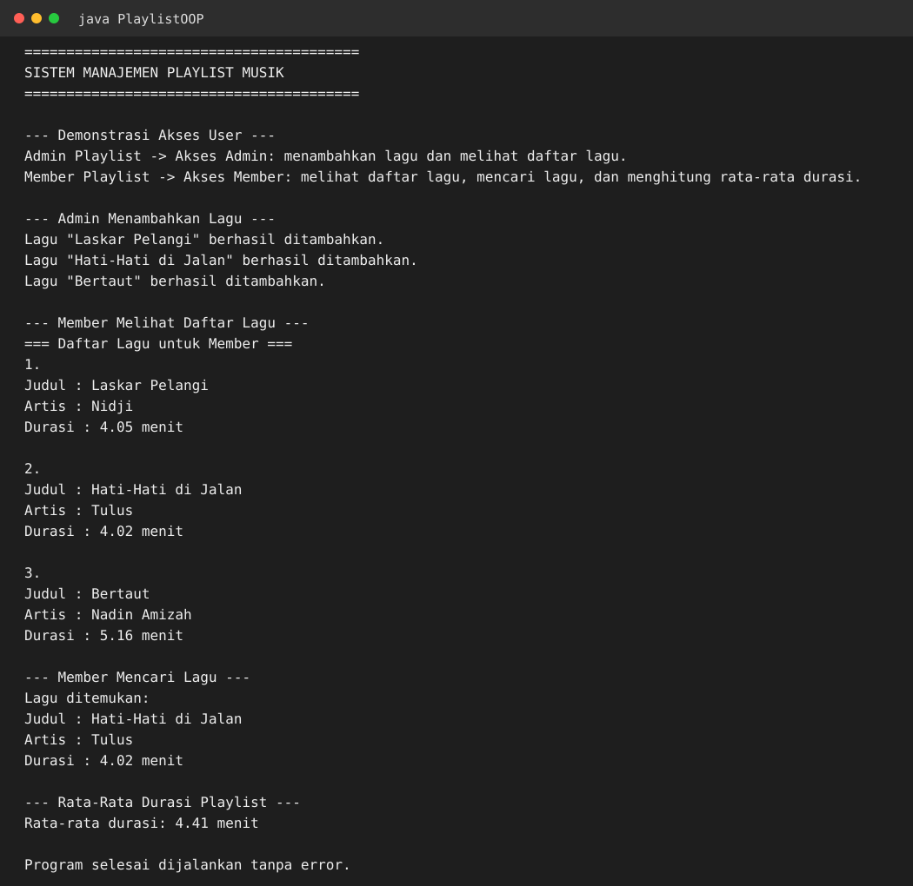

# R1 TK1 - Data Structures and Algorithm Analysis

Implementasi **Sistem Manajemen Playlist Musik** untuk Tugas Kelompok ke-1, Week 3, mata kuliah Data Structures and Algorithm Analysis.

## Requirement yang dipenuhi

- Program utama bernama `PlaylistOOP.java`.
- Menggunakan `Lagu[]` sebagai array untuk menyimpan kumpulan objek lagu.
- Menerapkan **encapsulation** melalui atribut `private` serta getter/setter.
- Menerapkan **inheritance** melalui `Admin extends User` dan `Member extends User`.
- Menerapkan **polymorphism** melalui override `tampilkanAkses()` pada `Admin` dan `Member`.
- `Admin` dapat menambahkan lagu dan melihat daftar lagu.
- `Member` dapat melihat daftar lagu, mencari lagu berdasarkan judul, dan menghitung rata-rata durasi playlist.
- Fungsi utama diberi komentar untuk menjelaskan logika program.

## Anggota kelompok

> NIM belum tersedia pada berkas tugas yang diberikan. Ganti `TODO` sebelum pengumpulan di LMS.

| Nama | Bagian | NIM |
|---|---|---|
| Muhammad Asyam Jayanegara | Class Member | TODO |
| Risman | Class Lagu | TODO |
| Prima | Laporan | TODO |
| Amel | Class User dan Admin | TODO |
| Putri | Method Main | TODO |

## Menjalankan program

Requirement: Java 17+ (program telah diverifikasi menggunakan OpenJDK 21).

```bash
javac PlaylistOOP.java
java PlaylistOOP
```

## Hasil pengujian

Program berhasil dikompilasi dan dijalankan tanpa error. Output pengujian tersedia di:

- [`execution-output.txt`](execution-output.txt)
- [`execution-screenshot.svg`](execution-screenshot.svg)

Screenshot hasil eksekusi:



## Fitur yang didemonstrasikan

1. Pemanggilan `tampilkanAkses()` melalui reference `User[]` untuk menunjukkan polymorphism.
2. Admin menambahkan beberapa objek `Lagu` ke array playlist.
3. Member melakukan traversal untuk melihat daftar lagu.
4. Member mencari lagu menggunakan linear search dan `equalsIgnoreCase()`.
5. Member menghitung rata-rata durasi seluruh lagu.

## Kompleksitas utama

- `Admin.tambahLagu()` : **O(1)**
- `Admin.lihatDaftarLagu()` : **O(n)**
- `Member.lihatDaftarLagu()` : **O(n)**
- `Member.cariLagu()` : **O(n)** worst case
- `Member.hitungRataRataDurasi()` : **O(n)**
- Extra space untuk operasi di atas : **O(1)**

## Deliverables

- [x] File `.java`
- [x] Screenshot hasil eksekusi
- [x] Link GitHub
- [ ] NIM seluruh anggota diisi sebelum submit
- [ ] Upload/submit jawaban ke LMS oleh anggota kelompok
